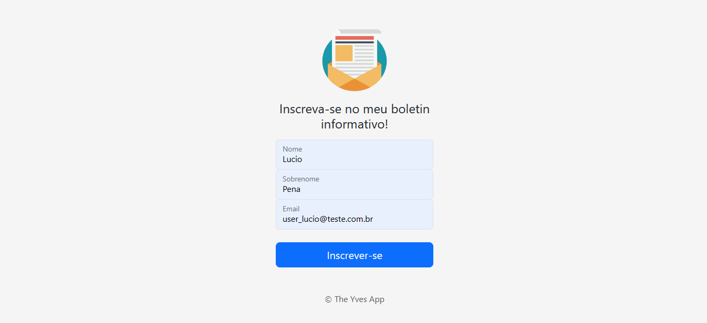
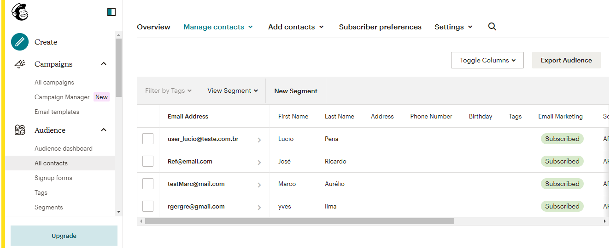
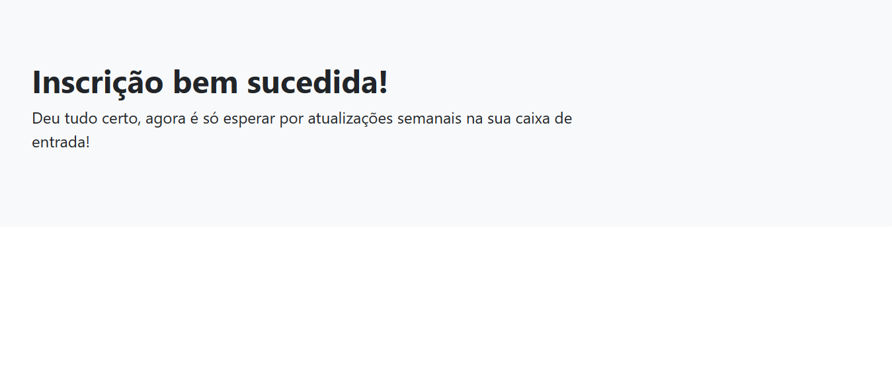
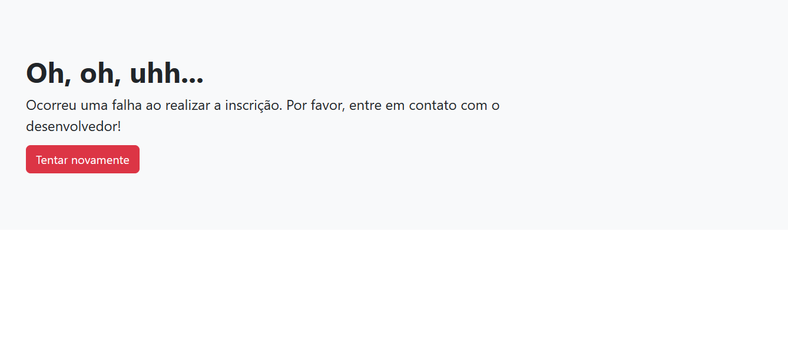

<h1 align="center"> Newslatter Signup </h1>

  

 Projeto desenvolvido com NodeJS, Express, Bootstrap, CSS e HTML.
 

  <a href="#-sobre-o-projeto">Sobre o projeto</a>&nbsp;&nbsp;&nbsp;|&nbsp;&nbsp;&nbsp; 
  <a href="#-layouts">Layouts</a>&nbsp;&nbsp;&nbsp;|&nbsp;&nbsp;&nbsp;
  <a href="#-requisitos-e-recomendações">Requisitos e recomendações</a>&nbsp;&nbsp;&nbsp;&nbsp;&nbsp;&nbsp;

</img>

# 💻 Sobre o projeto 

Sistema de inscrição para boletins informativos utilizando a API MailChimp. O objetivo do projeto é aplicar alguns dos conhecimentos de node, express e integração de APIs externas. Nele, o usuário pode realizar a inscrição para receber boletins informativos de alguma empresa ou pessoa de influência. O sistema, apesar de simples, pode ser utilizado dentro de projetos maiores que se beneficiariam deste tipo de serviço. 

  

# 📸 Layouts 

<h3 align="center">Tela inicial de inscrição</h3>

</img>

 
<h3 align="center">Controle de emails cadastrados no MailChimp</h3>

</img>
 
 
<h3 align="center">Callback de sucesso</h3>

</img>
 
 
<h3 align="center">Callback de erro</h3>

</img>
 

  

# 📝 Requisitos e recomendações

PARA ACESSAR O PROJETO:
- <a href="https://secure-crag-57420.herokuapp.com/">App hospedado no heroku.</a>

  

# ✒️ Autor

Yves Lima Silva

<a href="https://www.linkedin.com/in/yves-lima-b63b2515b/"> Linkedin </a>
